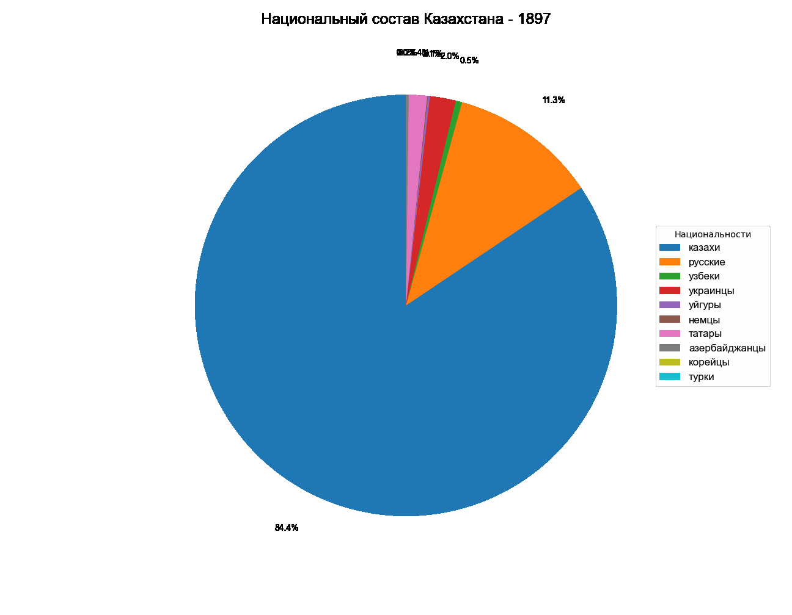

# Chronology-of-the-national-composition-of-Kazakhstan

I visualized the chronology of changes in the national composition of Kazakhstan 🇰🇿

I made this visualization in Python using Matplotlib, NumPy, Pandas.

Source: Population census data for 1897, 1926, 1939, 1959, 1970, 1979, 1989, 1999, 2009, and 2021.

Conclusions:

**Kazakhs:** In 1897, the number of Kazakhs was about 3.4 million people. The famine of 1921 led to a decrease in numbers, and by 1926 there were 3.6 million Kazakhs. The famine of 1932-1933, caused by Stalinist collectivization, reduced the population to 2.1 million people in 1939. The post-World War II recovery led to an increase in the population to 2.8 million by 1959. During the stabilization period, the number continued to grow: 4.2 million in 1970, 5.3 million in 1979, and 6.5 million in 1989. In the post-Soviet period, the number of Kazakhs reached 13.5 million people by 2021.

**Russians:** In 1897, the number of Russians in Kazakhstan was about 454 thousand people. During the period of industrialization and deportations of the 1930s and 1950s, their number increased significantly: 1.3 million people in 1926 and 2.5 million people in 1939. After World War II, the number of Russians continued to grow, peaking at 6.2 million by 1989. After the collapse of the USSR, many Russians emigrated, which led to a decrease in the number to 4.5 million in 1999 and less than 3 million by 2021.

**Ukrainians:** In 1897, the number of Ukrainians in Kazakhstan was about 80 thousand people. During the Stalinist repressions of the 1930s and 1950s, their number increased significantly due to deportations, reaching 860 thousand people in 1926 and 658 thousand people in 1939. After the collapse of the USSR, the number of Ukrainians decreased significantly: in 1999 there were 547 thousand, and by 2021 - 387 thousand people.

**Germans:** In 1897, the number of Germans in Kazakhstan was about 2.6 thousand people. During the Second World War, a significant number of Germans were deported to Kazakhstan, which increased their number to 92 thousand people in 1939 and to 659 thousand people in 1959. In the post-Soviet period, many Germans emigrated to Germany, reducing the number to 353 thousand in 1999 and to 226 thousand in 2021.

**Koreans:** In 1897, there were practically no Koreans in Kazakhstan. In 1937, a large number of Koreans were deported to Kazakhstan from the Far East, and their number amounted to about 96 thousand people in 1939. In the post-war period, the number of Koreans increased to 74 thousand people in 1959 and to 118 thousand people in 2021.
